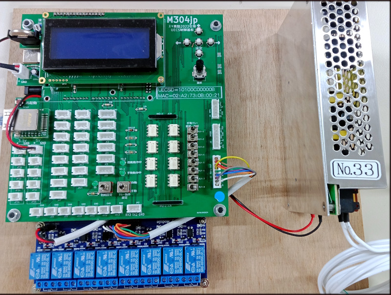

# M304 Library
M304 Library

Ver: 1.3.18

## Objectives

A stumbling block to smart farming diffusion
Reason: Discrepancy between the cost farmers can pay and what farmers can operate.

Build and install the UECS device (node) by yourself.  
Provide the basic system portion, as it is very difficult to do.

Development of hardware and software that everyone can use.

Important!

M304-lowcode v3.x.x you must need this library this version.

## Photo

## Need Other libraries for Make

|  Used library | Version | Path                                        |
|:-------------:|:-------:|:--------------------------------------------|
| LiquidCrystal | 1.0.7   | libraries/LiquidCrystal                     |
| SPI           | 1.0     | arduino/hardware/avr/1.8.6/libraries/SPI    |
| Ethernet2     | 1.0.4   | libraries/Ethernet2                         |
| EEPROM        | 2.0     | arduino/hardware/avr/1.8.6/libraries/EEPROM |
| AT24Cx        |         | libraries/AT24Cx                            |
| Wire          | 1.0     | arduino/hardware/avr/1.8.6/libraries/Wire   |
| DS1307RTC     | 1.4.1   | libraries/DS1307RTC                         |
| Time          | 1.6.1   | libraries/Time                              |
| LibYxml       | 1.0.2   | libraries/LibYxml                           |

| Used platform | Version | Path                      |
|:-------------:|:-------:|:--------------------------|
| arduino:avr   | 1.8.6   |arduino/hardware/avr/1.8.6 |

## How to use this library

Details will be described in the future.
